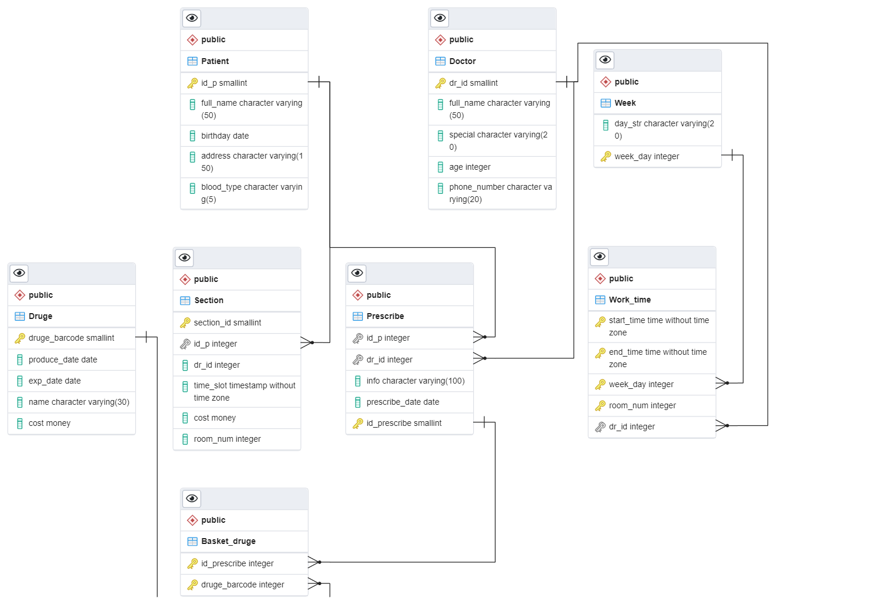

    <h1>پروژه درس پایگاه داده</h1>
    
هدف اصلی پیاده سازی پایگاه داده یک مطب می باشد با استفاده از پایگاه داده postgres 

<h3>ساختار</h3>
<ul>
    <li>database: شامل موارد مرتبط با پایگاه داده می باشد نظیر کوئری هایی که برای ایجاد اسکیما استفاده شده است</li>
    <li>pictures: مستندات و عکس ها</li>
    <li>src: سورس اصلی</li>
    <li>test: تست واحد و بررسی صحت سنجی</li>
</ul>

  وابستگی های پروژه در requirements.txt مشخص شده اند که صرفا شامل psycopg می باشد.

  __لطفا قبل از اجرا تنظیمات دیتابیس محلی را در فایل database.properties وارد کنید__

